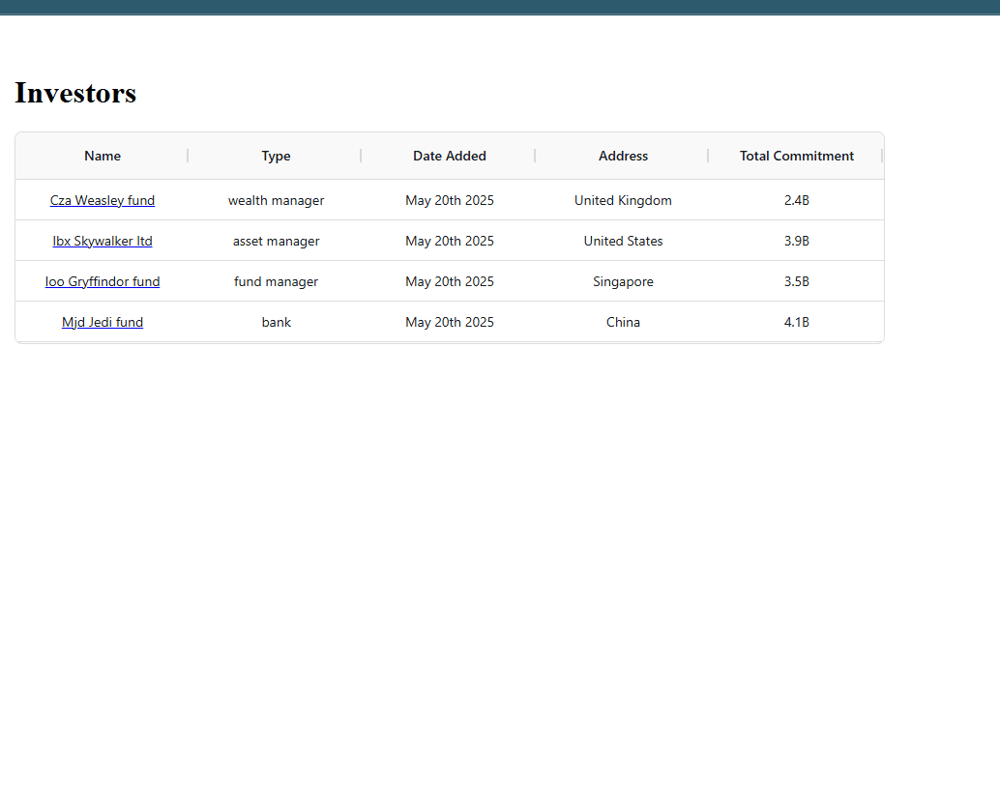

# Test
Investor Info

# Backend written in c# asp.net core

Open solution InvestorInfo.sln in VS 2022+
Run the project either in debug/release
used SqLite, EfCore for DB.

# Front end written in React
Open the folder investor-info-ui in VSCode
run the following commands
- npm install
- npm run dev
- For test cases - npm run test

used aggrid, moment, numeral packages

# Real time gif

